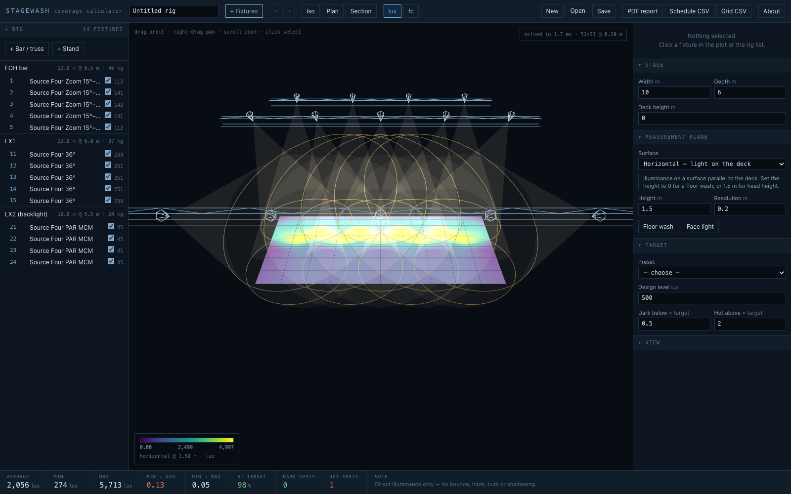

# stagewash user guide

**Model a stage and a lighting rig, focus the fixtures, and see the light levels and coverage on
the deck — before you get to the venue.**

A browser app. Nothing is installed, nothing is uploaded: the whole calculation runs in the tab.

> **Before you rely on this:** the illuminance model is **calibrated rather than assumed** — eight
> published photometric rows from real datasheets are held as tests, and the estimator lands within
> about 10% given a manufacturer's own field lumens, about 25% from bare lamp lumens alone. The
> importers are checked against real files: an entire published fixture bundle, 132 photometric
> files, parses with no failures or warnings, and candela tables integrate back over the sphere to
> the lamp flux the file declares within 0.1%.
>
> **This is a direct illuminance calculation only** — no inter-reflection, haze, shutter cuts,
> gobos or shadowing — and **nothing here has ever been checked against a light meter on a real
> stage.**
>
> This codebase was created with AI assistance, directed and reviewed by a human author.

---

## The two planes, which is the point

Most of the value in this tool is in a single toggle.

- **Horizontal** — illuminance on a surface parallel to the deck. The classic floor wash.
- **Vertical** — illuminance on a surface facing the audience, at head height. **What a *face*
  receives.**

**A rig can look perfectly even on the floor and be flat and shadowless on faces**, because
overhead light arrives nearly edge-on to a vertical surface and contributes almost nothing to it.

Flip between the two and the ranking of your fixtures inverts: on the default rig **the backlight
contributes exactly zero to the face plane**, and the front-of-house units more than double.

That is the calculation catching the most common mistake in a stage rig. If you read nothing else
here, flip that toggle before you sign off a plot.

---

## Building a rig

**Truss, scaff, bars and wind-up stands.** Hang fixtures along a bar at a spacing, or place them
individually.

**Focus** by aiming a fixture at a point on the stage — it resolves the pan and tilt for you — or
set pan and tilt directly. Zoom fixtures have a zoom; **moving heads are checked against their pan
and tilt range**, so an impossible focus is reported rather than drawn.

**See the levels** as a heatmap on the stage, updated as you drag, with beam cones and footprints
in a rotatable wireframe plot.

**Find the problems**: uniformity, coverage against a design level, and **contiguous hot and dark
spots listed by area with their centres** — which is the form you can actually act on, rather than
a number for the whole stage.

---

## How much to trust a fixture's numbers

Every fixture carries a **badge saying where its numbers came from**, because a lux figure computed
from a guess is worth nothing and you have to be able to tell which is which.

| Badge | What it means |
| --- | --- |
| **measured** | Read from a manufacturer photometric file (`.ies` / `.ldt`) that you imported. As good as this gets — **do this when the answer has to be right.** |
| **published** | Beam angle, field angle and centre-beam candela transcribed from a named datasheet; only the roll-off between those anchors is modelled. |
| **estimated** | A generic archetype synthesised from lamp output and beam angle. Useful for blocking out a rig, **not for promising a level.** Always named `Generic`. |

Building a custom fixture: **if you have its centre-beam candela, or its lux at a stated distance,
use that** — it assumes nothing. **Bare lamp lumens is the weakest option**, because it has to
assume an optical efficiency, and real fixtures of the same class run anywhere from 42% to 65%.

### The real floor on accuracy

Worth knowing before you argue with a number: for four of eight fixtures checked, the
manufacturer's **own** photometric file and the manufacturer's **own** datasheet agree to within
1% — and for the other four they differ by **5–15%**, because the files and the sheets are
different revisions.

**±15% between two first-party sources for the same fixture is the real floor on accuracy in this
business.** It is larger than anything the maths in here contributes.

---

## What is not modelled

Inverse square, the cosine law, and each fixture's intensity distribution. That is all.

It does **not** model inter-reflection from the deck, walls or a cyc; atmospheric haze; shutter
cuts, gobos or barn doors; or shadowing by people and scenery.

**On a dark stage that is the right model. In a white studio, inter-reflection can add a third
again to these figures.**

---

## Reporting

A PDF with the levels, the problem areas, a full fixture schedule with focus and heights, and the
structural loading.

It carries **three plots drawn from the same model** — the heatmap in plan with a colour key, an
isometric of the rig and its beams, and a wireframe layout by channel that **shares the plan's
frame, so a pool on the map sits over the fixture that made it.** Plus CSV of the schedule and of
the raw grid.

---

## If a number looks wrong

| Symptom | Cause |
| --- | --- |
| **Faces are dark and the floor is even** | The vertical plane. That is the toggle, and the point of the tool. |
| **A level is 15% off a manufacturer's figure** | That is within the gap between the manufacturer's own file and its own datasheet. |
| **A studio reads darker than it looks** | Inter-reflection is not modelled, and can add a third again in a white room. |
| **A fixture is badged `estimated`** | Its numbers are synthesised. Import a photometric file when the answer has to be right. |
| **A focus is refused** | The moving head cannot reach it within its pan/tilt range. |
